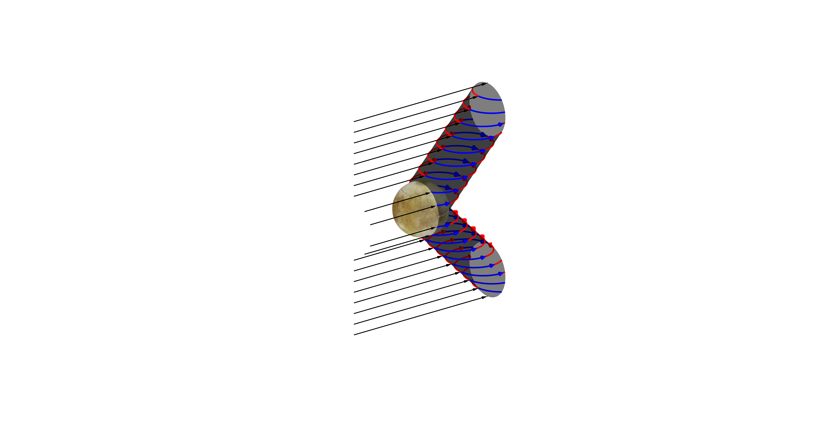

# PlotScripts
 A few plot scripts in Julia and Matlab, used for my publications.
 
 ## Matlab script to visualize spacecraft trajectories
 folder trajectories_matlab
 
 
 ## Julia script to compare magnetic field data from the Galileo spacecraft vs simulations
  folder spectra_julia
  
  
 ## Julia/LaTex script to generate Ion Spectra from the AIKEF C++ code
   folder spectra_julia
   
 
 ## Matlab script for a magnetic field schematic
 folder wings_matlab
 
