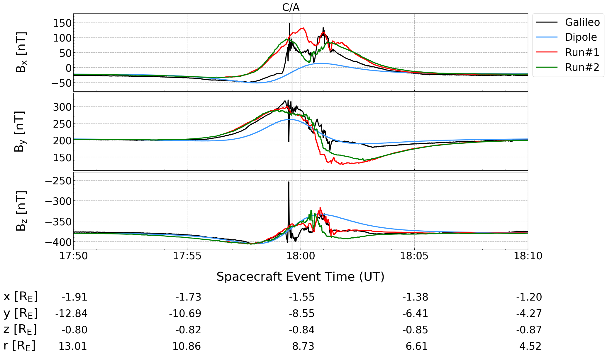

A Julia Jupyter Notebook to plot Galileo spacecraft and simulation data. 

### Requirements
The Galileo spacecraft data in EphIo coordinates (Europa's coordinate system) and the AIKEF C++ output (https://github.com/harnold8/E26/tree/master/run1) is needed.

The challenge was to convert the time string from the spacecraft and to ''draw'' a custom x-axis (the area bellow ''Spacecraft Event Time'')
