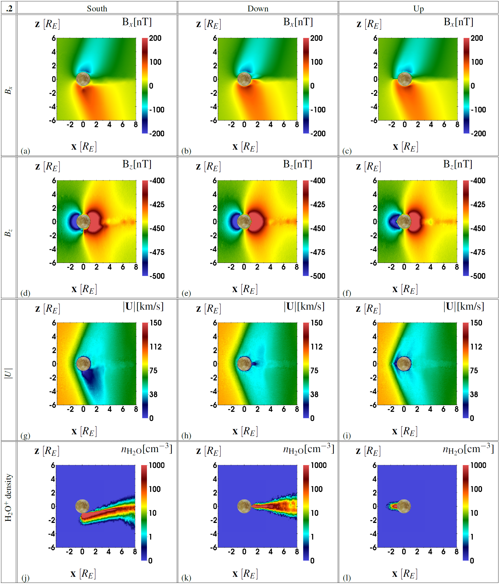

A Python 2.7 script that unnormalizes the simulation output (the simulation parameters can be set in example_plot_file.py), calls the 3D visualization software VisIt (https://wci.llnl.gov/simulation/computer-codes/visit/) and converts the png files to a LaTex pdf table.

### Requirements
* Python 2.7
* LaTex, must be linked in visit_plot.py
* VisIt, must be linked in visit_plot.py
* an AIKEF C++ output (https://github.com/harnold8/E26/tree/master/run1) is needed.
* [optional] a map of Europa (for the center of each plot)
