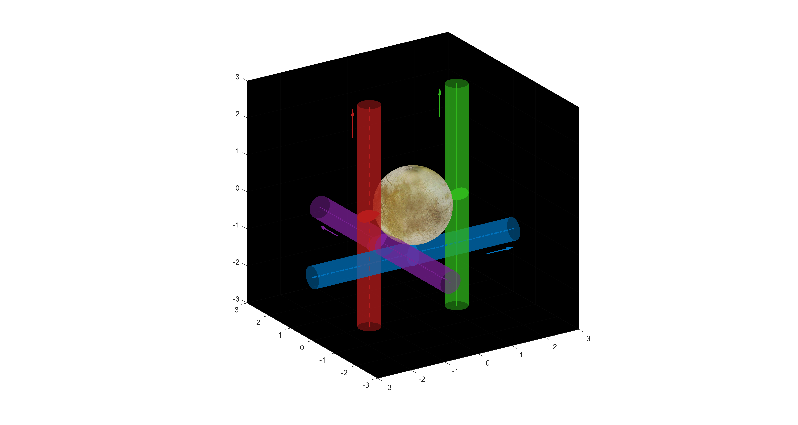

A Matlab script (trajectories.m) to visualize synthetic spacecraft trajectories around Jupiter's moon Europa.

### Requirements
* in the folders plume1-plume4 the file ''densitymap.txt'' contains the density data for the plumes. 
* traj*1.3 contains the trajectory data.
* europa2.tif is the texture for the sphere (moon Europa). 

