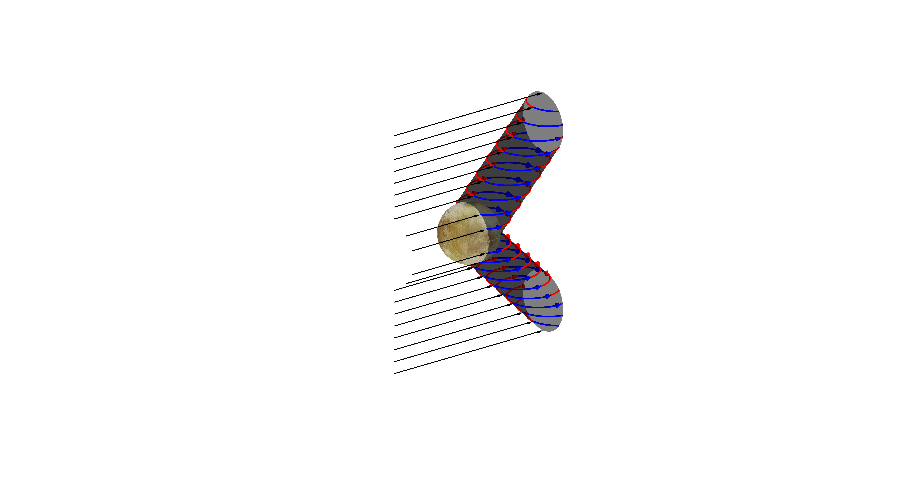

Matlab script (alfven_wings.m) to draw a schematic for the magnetic field in Europa's vicinity.

### Requirements 
* Needs europa2.tif (texture of moon Europa) to map it onto a sphere.

To plot the figure, various trigonometry challenges were solved (e.g., inclination of a cylinder, correct bending of the arrows) 
